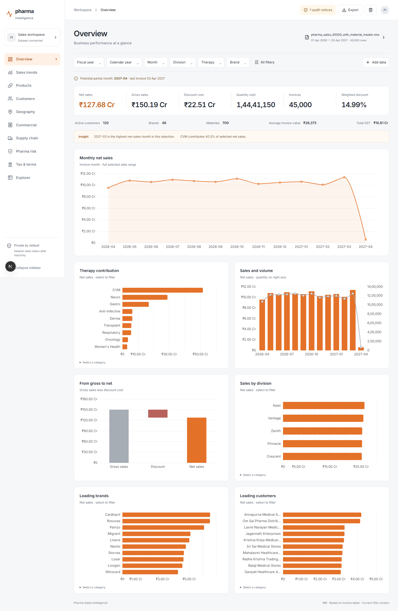

<div align="center">

# Pharma Sales Intelligence

**Drop in an XLSX workbook. Get ten analytical dashboards, audited totals, and boardroom-ready exports.**

### [→ Try it live](https://frontend-vert-three-56.vercel.app)

[](https://nextjs.org)
[](https://react.dev)
[](https://www.typescriptlang.org)
[](https://tailwindcss.com)
[](https://echarts.apache.org)
[](https://fastapi.tiangolo.com)
[](https://www.python.org)
[](https://duckdb.org)
[](https://vercel.com)



</div>

---

## Overview

A pharmaceutical sales intelligence website. Upload one or more sales workbooks and the backend identifies each sheet from its **headings, not its name**, audits the rows, and serves ten linked analytical views. No dashboard data is bundled or auto-loaded — the app starts empty every time.

Money is parsed as `Decimal` and rounded half-up to integer paise, so reported totals are authoritative rather than float-drifted. Bad rows are rejected and counted; suspicious rows are flagged, never silently deleted.

## Features

| | |
|---|---|
| **Heading-based ingestion** | Sheets recognised by their columns. Aliases, required fields and the filter whitelist live in one place: `backend/schema.py`. |
| **Ten analytical views** | Overview, Sales trends, Products, Customers, Geography, Commercial, Supply chain, Pharma risk, Tax & terms, Explorer. |
| **Cross-page filters** | Filter bar, **All filters**, or click a chart category. Filters persist across pages; clear a chip or **Reset filters** to restore context. |
| **Data quality audit** | Source-year inconsistencies, row-formula breaks, negative transactions and potential duplicates surfaced as explicit notices. |
| **Multi-workbook sessions** | Add historical workbooks incrementally. Identical file bytes are rejected to prevent double counting. |
| **Fiscal-year comparison** | Matched-active-date comparison on month/day values present in both years — transparent, not an inferred growth rate. |
| **Explorer** | Search, sort, choose columns, inspect rows, view batch data, download filtered CSV. 50 rows per page. |
| **PDF & PPTX export** | Nine analytical pages as landscape PDF or widescreen PowerPoint from one atomic backend snapshot. |

## Quick start

Requires **Node.js 20.9+** and **Python 3.12**.

```powershell
.\setup.ps1
.\run.ps1
```

Open <http://localhost:3000> and keep the terminal running. `Ctrl+C` stops it. The backend binds only to `127.0.0.1:8000`; the browser reaches it through Next.js. Run a single backend worker.

<details>
<summary>Run the two servers separately for development</summary>

```powershell
.\.venv\Scripts\Activate.ps1
python -m uvicorn backend.main:app --host 127.0.0.1 --port 8000
```

```powershell
cd frontend
npm run dev
```

</details>

## Usage

1. Drop XLSX workbooks or choose **Browse workbooks**.
2. Review **Data quality**. The supplied workbook has 215 source-year inconsistencies; invoice dates remain authoritative.
3. Navigate the ten views and filter across them.
4. Add historical workbooks with **Add data**; the dataset panel offers replacement after a duplicate upload.
5. Export a selection or all nine analytical pages to PDF or PPTX — four key charts per page, with current filters, date coverage, dataset names, timestamp and page numbers, and no app navigation.
6. Remove individual workbooks from **Your dataset**, or **Clear all data**. Removing the last file destroys the session and returns the empty state.

## Data contract

**Required headings:** Invoice Date, Invoice Number, Payer, Material, Quantity, Sale Value, Net Amount.
Recommended and optional headings appear under **View expected schema** and are defined centrally in `backend/schema.py`.

- Gross sales = Sale Value. Net sales = Net Amount. Discount cost = gross − net.
- Source Discount Value is expected to equal net − gross. Weighted discount is discount cost ÷ gross — not the mean of the source Discount Rate.
- Amounts parsed as `Decimal`, rounded half-up to integer paise. Row formula tolerance is ₹0.02. Charts present numeric conversions of these sums.
- All four GST components must be present to report total GST; unknown components are never zero-filled.
- Invoice dates drive calendar year, April-start fiscal year, month, quarter and fiscal quarter.
- Malformed required rows are rejected and counted. Negative transactions and potential duplicates stay in, flagged.
- Lead-time measures exclude negative intervals. Shelf life is measured at sale; negative shelf life is retained as expired-at-sale exposure.
- Refrigeration / 2–8 °C descriptions identify cold-chain sales — a source-description classification, not a validated handling spec.
- Exact file hashes block duplicate uploads. Content overlap between different files is audited, not auto-deduplicated.

## Deployment

Live at **<https://frontend-vert-three-56.vercel.app>**. Two Vercel projects from this one repository:

| Project | Root | Serves |
|---|---|---|
| `frontend` | `frontend/` | Public Next.js site; proxies `/api` to the backend |
| `backend` | `backend/` | FastAPI service, daily cleanup cron |

| Environment variable | Used by | Purpose |
|---|---|---|
| `BACKEND_URL` | frontend | Upstream for the `/api` rewrite |
| `BLOB_READ_WRITE_TOKEN` | both | Private Vercel Blob store — uploads, normalized frames, session manifest |
| `ALLOWED_ORIGINS` | backend | Production frontend URL |
| `CRON_SECRET` | backend | Protects `/api/cleanup` |

## Privacy and limits

Browser state holds aggregates and the current table page, never the full dataset. No workbook is written to the repository. Local sessions live in memory and expire after one hour. Production sessions use private Blob storage so they survive serverless instance changes, and scheduled cleanup removes session files after 24 hours. Clearing data deletes its Blob objects immediately; reloading the page starts empty while the abandoned server session expires on its own.

**Limits:** 100 MB compressed per workbook, 800 MB uncompressed workbook XML, 600,000 rows per session. The 45,000-row supplied workbook is verified; 500,000+ row performance is not benchmarked. The public deployment has no user accounts — anyone with the URL can create an isolated temporary session.

**Deliberately absent:** maps, because the input contains no verified coordinates. Charts without values render an explicit empty state. PDF/PPTX use condensed export layouts rather than every exploratory visual, and PPTX slides carry high-resolution rendered images, not editable native charts.

## Verification

```powershell
.\.venv\Scripts\python.exe -m pytest backend/tests -q
.\.venv\Scripts\python.exe tests/make_fixtures.py
.\.venv\Scripts\python.exe tests/review_workbook.py 'C:\path\pharma_sales_45000_with_material_master.xlsx'

cd frontend
npm test
npm run build
npm run test:e2e   # requires both servers running
```

Set `PHARMA_TEST_WORKBOOK` to point at a different location of the supplied fixture; the independent control review expects its documented 45,000 rows. `tests/make_fixtures.py` generates small synthetic yearly workbooks for tests only.

Tests cover financial relationships and totals, optional missing fields, invalid rows, filters, multi-year comparison, duplicate hashes, material conflicts, removal, frontend formatting and the browser workflow. Repeated queries are cached per session in the browser and invalidated on mutation; superseded requests are cancelled; Explorer search is debounced without unmounting its input.

Optional independent export inspection runs through `tests/verify_exports.py` with `pypdf`, `pypdfium2` and `Pillow` — QA-only packages, not required to run the site.

## Project structure

```
backend/
  schema.py     explicit aliases, required fields, filter whitelist
  engine.py     ingestion, audit, normalization, measures, analytics, Explorer
  main.py       session lifecycle, isolated API, upload limits, atomic export snapshots
  tests/
frontend/
  app/          application shell, shared styling, server-rendered exports
  components/   ECharts rendering, dashboard views, fiscal comparison
  e2e/
tests/          independent source controls and fixture generation
reports/        workbook review, verification record, saved screenshots and exports
```

## Further reading

- [`reports/brief-review.md`](reports/brief-review.md) — brief interpretation and workbook findings
- [`reports/verification.md`](reports/verification.md) — completed verification record
- [`DESIGN.md`](DESIGN.md) · [`PRODUCT.md`](PRODUCT.md)
